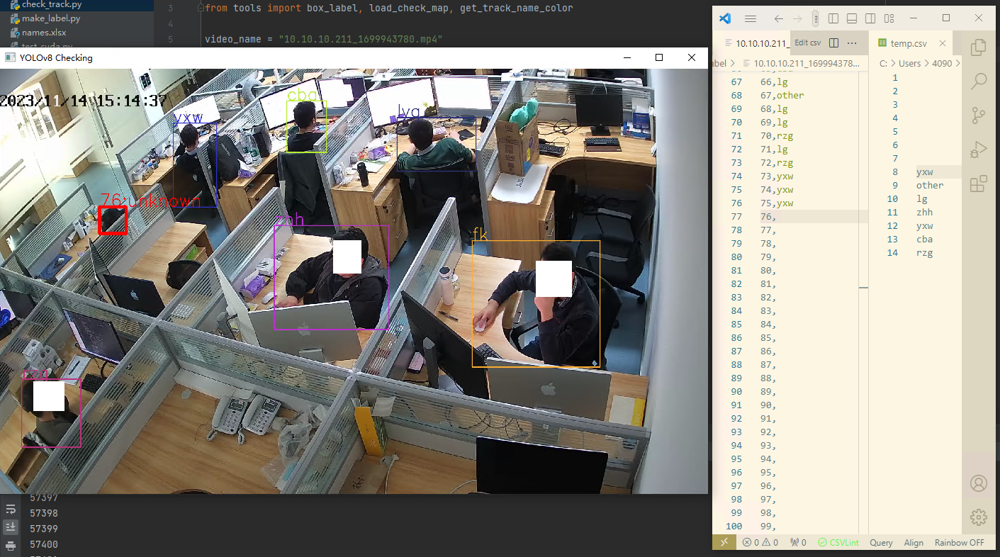

# Semi_automatic_tracking_annotation_tool
视频的人员半自动跟踪标注工具，支持自定义规则，python 代码量很少

1. 使用yolov8自动跟踪功能，跟踪人，可以自定义改成跟踪其它coco数据集中存在的分类
2. 保存跟踪结果为auto_track，并生成空的映射文件track_map
3. 读取跟踪结果和映射结果，并可视化
4. 手动填写track_map,已完成整段视频的精准标注

